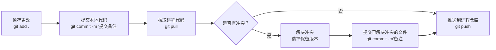

# 一、Unity开发流程基础


## 1.Unity 项目结构


### 1.1场景

- 场景是一个**虚拟空间**，用于承载**物体对象**（GameObject）、光源、摄像机、UI 界面等元素。


### 1.2资源

- 常见资源类型（按功能分类）

| 类别         | 资源名称      | 常用格式                                               | 用途说明                          |
| ------------ | ------------- | ------------------------------------------------------ | --------------------------------- |
| **图像资源** | 图片 / 贴图   | `.png`, `.jpg`, `.psd`, `.tga`, `.bmp`, `.gif`（静态） | UI 图标、模型贴图、背景图、按钮等 |
| **3D 模型**  | 角色/场景模型 | `.fbx`, `.obj`, `.dae`, `.3ds`, `.blend`               | 构建角色、建筑、道具等三维对象    |
| **音频资源** | 音效 / 音乐   | `.wav`, `.mp3`, `.ogg`, `.aiff`                        | 背景音乐、角色语音、操作反馈      |
| **视频资源** | 视频剪辑      | `.mp4`, `.mov`, `.webm`, `.avi`                        | 开场动画、过场视频、引导内容      |
| **字体资源** | 字体文件      | `.ttf`, `.otf`                                         | UI 文字显示、特定风格字型         |
| **动画资源** | 动画动作      | `.anim`, `.fbx`（含动画）、`.controller`               | 角色动作、UI 动效、状态切换       |

- Unity 专有资源类型（编辑器生成或特有结构）

| 文件类型        | 后缀名                               | 用途说明                                      |
| --------------- | ------------------------------------ | --------------------------------------------- |
| 预制体          | `.prefab`                            | 可复用对象组合，如角色、按钮、道具等          |
| 场景文件        | `.unity`                             | 定义场景结构、对象布置、环境设置              |
| 材质            | `.mat`                               | 绑定贴图、定义表面特性                        |
| Shader 着色器   | `.shader`, `.shadergraph`            | 控制渲染效果，如发光、透明、水波等            |
| 动画控制器      | `.controller`, `.overrideController` | 管理动画状态机逻辑（如走路→跑步）             |
| 配置资源对象    | `.asset`                             | 由 ScriptableObject 创建的自定义配置文件      |
| 光照 / 导航数据 | `.asset`                             | Lighting / NavMesh / Occlusion 等系统资源数据 |
| 元信息文件      | `.meta`                              | 每个资源自动生成，标识唯一性，确保引用一致性  |
| 时间轴 / 过场   | `.playable`（内部）                  | 控制剧情播放、镜头切换、对白时序等            |

- 数据配置资源（策划常用）

| 类型                          | 格式               | 用途说明                                        |
| ----------------------------- | ------------------ | ----------------------------------------------- |
| JSON 数据                     | `.json`            | 常用于软件数据、热更新配置、镜头数据            |
| CSV / 表格                    | `.csv`, `.xls(x)`  | 多语言文本、软件数据、步骤参数                  |
| 文本文件                      | `.txt`, `.ini`     | 简单配置                                        |
| XML 文件                      | `.xml`             | 结构化数据，部分老项目使用                      |
| ScriptableObject              | `.asset`           | Unity配置、镜头数据、插件配置等，支持可视化编辑 |
| [PlayerPrefs](Image/mono.png) | 无文件（本地存储） | 本地轻量设定，如音量、语言选择等 （写入注册表） |

- 其他重要文件

| 类型     | 文件名 / 格式                 | 用途说明                             |
| -------- | ----------------------------- | ------------------------------------ |
| 脚本文件 | `.cs`（C# 语言）              | 控制程序逻辑、交互、行为             |
| 插件文件 | `.dll`, `.aar`, `.jar`, `.so` | 引入第三方库（如 SDK、广告、支付等） |


### 1.3预制体

- **复用性强**
  - 预制体是已经配置好属性和组件的游戏对象模板，可以在项目中多次实例化，避免重复制作相同对象。

- **统一管理和批量修改**
  - 修改预制体资源，会同步更新所有场景中该预制体的实例，方便维护和统一调整。

- **场景整洁和结构清晰**
  - 通过使用预制体，把复杂的对象组合封装起来，使场景层级更简洁，便于管理。

- **支持动态加载和实例化**
  - 可以在游戏运行时，通过代码动态加载预制体并生成对象，实现灵活的游戏逻辑和资源管理。

- **版本控制友好**
  - 预制体文件独立保存，便于与版本管理系统配合使用，避免大规模场景文件冲突。

- **提高开发效率**
  - 美术、程序和策划协同制作和调试同一个预制体，节省时间并减少沟通成本。


## 2.项目构建

**2.1.选择目标平台**

- Unity 支持多平台构建，如 Windows、Mac、iOS、Android、WebGL、主机平台、团结支持鸿蒙等。根据项目需求选择目标平台。

**2.2.构建设置(Build Settings)**

- 场景选择：决定哪些场景会被打包进最终包
- 目标平台：选择发布平台（例如 Android）
- 构建选项：是否开启压缩、开发者模式、脚本调试等

**2.3.压缩与资源打包**

- 开启压缩能减少包体积，但会增加加载时间和打包时间
- 资源是否分包（AssetBundle/Addressables）影响更新和加载效率，合理分包***（加载存在卡顿，资源过大或者资源包包含文件过多需要分包）***

**2.4.代码裁剪和优化**

- IL2CPP vs Mono（脚本后端选择）
- 代码剥离（Strip Engine Code）减少包体积


> Unity资源收集原理：收集已选择场景中的资源以及资源关联的资源、Resources文件夹中的资源（使用时通过`Resources.Load()` 加载）、C#脚本，全部打入exe之中。
>
> 热更构建：根据收集原理，仅收集一个启动场景（启动场景只包含下载界面），Resources文件夹不放资源，所有其他所有资源收集到AB包，使用AB包加载替代Resources加载，代码分为AOT层和Hotfix层，构建的exe中只包含插件、启动场景和AOT层代码。


# 二、核心概念与工作方式


## 1.GameObject 与组件（Component）结构

#### 1.1GameObject（游戏对象）

- **定义**：Unity 场景中的基础实体，***所有可见或不可见的对象都是 GameObject***。
- **特点**：
  - 仅是一个容器，本身不包含任何行为和渲染功能。
  - 可以包含多个组件来赋予它功能和特性。
  - 可以是空对象，也可以附加各种组件形成复杂实体。

#### 1.2. Component（组件）

- **定义**：附加在 GameObject 上的功能模块，决定该对象的表现和行为。
- **常见组件类型**：
  - `Transform`：位置、旋转、缩放，所有 GameObject 必备组件。
  - `Renderer`（如 MeshRenderer、SpriteRenderer）：负责显示模型或图片。
  - `Collider`：碰撞体，用于物理检测。
  - `Rigidbody`：物理刚体，实现物理运动。
  - 自定义脚本组件（继承 MonoBehaviour）：实现游戏逻辑、交互等。

#### 1.3. 结构关系

- 每个 GameObject **必须包含一个 Transform 组件**，用来确定其在世界或父对象中的空间位置。
- 通过给 GameObject 添加不同的组件，实现多样化的功能组合。
- 组件之间通过 GameObject 进行关联，协同工作。

#### 1.4. 设计理念

- **组合优于继承**
   - Unity 采用组件化设计，通过组合不同组件实现灵活多变的对象行为，而非通过复杂继承体系。

#### 1.5. 示例

一个 **角色 **GameObject，可能包含的组件： 

-  `Transform`（必备）

- `MeshRenderer`（显示模型）
- `Animator`（动画控制）
- `Rigidbody`（物理）
- 自定义脚本（控制角色移动、攻击等）

## 2.Transform：位置、旋转、缩放

- 每个 Unity GameObject 都自带的基础组件。
- 控制游戏对象在场景中的**空间位置、旋转方向和大小**。
- 是所有空间操作的基础。

## 3.场景管理

| 方式           | 说明                                                     | 适用场景                         |
| -------------- | -------------------------------------------------------- | -------------------------------- |
| 同步加载       | 立刻加载新场景，当前操作会暂停，等待加载完成             | 小型场景或加载时间短的切换       |
| 异步加载       | 在后台加载场景，不阻塞主线程，加载过程中可显示进度或动画 | 大型场景、加载界面、提升用户体验 |
| 多场景同时加载 | 同时加载多个场景，实现模块化设计（如UI场景 + 游戏场景）  | 复杂项目需要分层次管理场景       |

## 4.UI 系统

####  4.1.核心结构

| 组件          | 作用说明                                         |
| ------------- | ------------------------------------------------ |
| Canvas        | UI 的根节点，所有 UI 元素的承载容器              |
| RectTransform | UI 元素的位置、大小和锚点控制                    |
| UI 组件       | 如 Button（按钮）、Image（图片）、Text（文本）等 |

#### 4.2.Canvas（画布）

- [Canvas](https://docs.unity3d.com/cn/current/Manual/UICanvas.html "画布")是所有 UI 元素的父对象，控制 UI 渲染方式和分辨率适配。
- **Render Mode（渲染模式）**：
  - Screen Space - Overlay（覆盖屏幕）
  - Screen Space - Camera（依附摄像机）
  - World Space（3D世界空间中的UI）

#### 4.3.UI 元素常见组件

- **Button**：响应用户点击事件
- **Image**：显示图片或背景
- **Text / TextMeshPro**：显示文字信息
- **Slider、Scrollbar、InputField**：交互控件

#### 4.4.屏幕适配与锚点

- 使用 RectTransform 的锚点系统，实现不同分辨率和设备的自动适配。
- 保证 UI 在各种屏幕尺寸下保持合理布局和比例。

#### 4.5.事件系统

- UI 交互依赖 EventSystem 组件，处理点击、拖拽、滑动等事件。
- 事件通过组件（如 Button 的 OnClick）绑定对应响应函数。


# 三、脚本逻辑和数据交互

## 1.C# 简单了解

### 1.1.脚本作用

- 用于控制游戏对象的行为和交互逻辑。
- 实现游戏规则、动画控制、UI交互等功能。

### 1.2.脚本基本结构

- Unity 脚本通常继承自 `MonoBehaviour`。
- 主要包含以下生命周期函数：

| 函数名      | 触发时机                 | 作用说明               |
| ----------- | ------------------------ | ---------------------- |
| Awake       | 脚本实例化时调用         | 初始化数据，准备工作   |
| Start       | 游戏开始后第一帧调用     | 逻辑启动，准备就绪     |
| Update      | 每帧调用                 | 持续检测输入或更新状态 |
| FixedUpdate | 固定帧率调用（物理相关） | 处理物理模拟           |
| OnDestroy   | 脚本或对象销毁时调用     | 清理资源               |

### 1.3.面向对象编程

#### 面向对象基础--抽象

- 抽象是指从复杂的现实世界中提取出关键的、共同的特征，忽略不必要的细节。
- 它帮助我们聚焦于对象的本质属性和行为，而不关心具体实现细节。

##### 示例-表单抽象设计

##### 🧠 抽象思路

表单的类型虽然样式多样，但从交互和功能层面可以抽象为两个核心类型：

- **填空题（Input）**
- **选择题（选择/多选/下拉等 Toggle）**

统一这些类型背后共通的行为逻辑，抽象出通用的基类和接口以便扩展。

##### 🏗️ 基础抽象结构

##### `BaseAnswer`（基础答题父类）

所有答题控件（输入、选择）都继承自此类，包含统一行为：

```c#
class BaseAnswer : IHintInterface {
    // 1. 接收题目与答案数据
    public virtual void SetData(QuestionData data);

    // 2. 答案判断
    public virtual bool CheckAnswer();

    // 3. 按 T 提示（来自 IHintInterface）
    public virtual void HintAnswer();

    // 4. 错误提示
    public virtual void ShowErrorTip();

    // 5. 输入监听（用于答题状态联动）
    public virtual void RegisterInputListener();

    // 6. 禁用/启用
    public virtual void SetInteractable(bool state);

    // 7. 重置状态
    public virtual void Reset();
}
```

##### 📥 输入类（`InputAnswer`）

```c#
class InputAnswer : BaseAnswer {
    override void SetData(QuestionData data) {
        // 设置输入框文本、标题、宽度自适应
    }

    override bool CheckAnswer() {
        // 判断用户输入与正确答案是否一致
    }

    override void HintAnswer() {
        // 将正确答案填入输入框
    }

    override void ShowErrorTip() { ... }
    override void RegisterInputListener() { ... }
    override void SetInteractable(bool state) { ... }
    override void Reset() { ... }
}
```

------

##### ✅ 选择类（`ToggleAnswer`）

```c#
class ToggleAnswer : BaseAnswer {
    override void SetData(QuestionData data) {
        // 创建选项 Toggle，根据数据渲染
    }

    override bool CheckAnswer() {
        // 判断选择项与答案是否一致
    }

    override void HintAnswer() {
        // 自动勾选正确项，取消错误项
    }

    override void ShowErrorTip() { ... }
    override void RegisterInputListener() { ... }
    override void SetInteractable(bool state) { ... }
    override void Reset() { ... }
}
```

------

##### 🧩 表单容器（`FormDialog`）

```c#
class FormDialog 
{
    InputAnswer inputAnswer;
    ToggleAnswer toggleAnswer;

    void CheckAllAnswers() {
        inputAnswer.CheckAnswer();
        toggleAnswer.CheckAnswer();
    }
}
```

------

##### 💡 提示功能抽象：`IHintInterface`

```c#
interface IHintInterface {
    void HintAnswer();
}
```

> 不仅仅是答题表单可用，**拖拽题 (Drag)**、**工具题 (Tool)** 等也可复用该接口。

### 1.4.面向对象-继承封装多态

##### 1. **继承（Inheritance）**

- **概念**：子类继承父类的属性和方法，可以复用父类的代码。
- **例子**：比如，"猫" 和 "狗" 都是 "动物"，他们继承了 "动物" 的基本属性（如吃、睡）和行为（如移动）。但是 "猫" 和 "狗" 也可以有自己的独特行为（如猫会爬树，狗会看家）。

##### 2. **封装（Encapsulation）**

- **概念**：把对象的属性和方法包裹在一起，对外只暴露必要的接口，隐藏内部细节。
- **例子**：比如你用手机打电话，你只关心打电话的操作（按钮），而不需要知道手机内部如何工作（电路、信号等）。

##### 3. **多态（Polymorphism）**

- **概念**：同一个操作，在不同的对象上可以表现出不同的行为。
- **例子**：比如，"动物" 都有 "叫" 的功能，但 "猫" 会“喵喵叫”，"狗" 会“汪汪叫”。通过相同的接口（叫），不同的动物表现不同。


## 2.事件驱动机制

## Unity 事件系统组成

| 组件/概念    | 说明                               |
| ------------ | ---------------------------------- |
| EventSystem  | 统一管理和分发用户输入事件         |
| Input Module | 负责监听具体输入设备（鼠标、触摸） |
| UI 组件事件  | Button、Toggle 等组件触发事件      |
| 自定义事件   | 脚本中定义事件，代码间通信         |

## 事件绑定方式

- **编辑器绑定**
   在 `Inspector` 面板给 UI 组件的事件（如 Button 的 OnClick）绑定函数。
- **代码绑定**
   通过脚本使用委托或事件机制动态绑定处理函数。

## 示例

```C#
public Button myButton;

void Start() {
    myButton.onClick.AddListener(OnButtonClicked);
}

void OnButtonClicked() {
    Debug.Log("按钮被点击了！");
}
```


## 3.状态控制

#### 步骤状态控制

- 加载完场景和界面之后，需要进入具体的环节之中，每个环节会处于不同的“状态”（如进入步骤、动作①、动作②、........ 、步骤完成、退出步骤等）。
- 状态控制用于管理这些不同状态下的行为逻辑切换。

####  常见状态示例

| 状态名称        | 含义                     |
| --------------- | ------------------------ |
| OnEnter()       | 进入步骤，初始化阶段     |
| SetEnterState() | 进入状态                 |
| SetState()      | 设置当前步骤正进行的动作 |
| SetExitState()  | 退出状态                 |
| OnExit()        | 离开步骤，重置步骤阶段   |

#### 状态切换方式

- **状态机设计**：用有限状态机设计模式，明确定义状态和切换条件。

  ```C#
  public override void OnEnter()
  {
      base.OnEnter();
      Debug.Log("进入-增加截面法-四面围套-安装模板");
      ActionIndex++;
  }
  
  public override void SetEnterState()
  {
      base.SetEnterState();
      JGSGSceneManager.Instance.KeepAnimationClipStart("长动画分段", "安装模板");
  }
  
  public override async void SetState(int index)
  {
      base.SetState(index);
      switch (index)
      {
           case 0:
              //动作一
              ActionIndex++;
           break;
           case 1:
              //动作二
              ActionIndex++;
           break;
           case 2:
              StepController.Instance.NextStep();
           break;
       }
  }
  
  public override void SetExitState()
  {
      base.SetExitState();
      JGSGSceneManager.Instance.KeepAnimationClipEnd("长动画分段", "安装模板");
  }
  
  public override void OnExit()
  {
      base.OnExit();
      Debug.Log("退出-增加截面法-四面围套-安装模板");
  }
  ```

- **条件触发**：根据点击步骤操作或事件触发，改变当前状态。

  ```
  //当前步骤的步骤类
  private StepBase curStepNode;
  //跳转到某个步骤（传入跳转的步骤类）
  public void SetStepNode(StepBase target)
  {
      //调用当前步骤-离开方法，重置当前步骤
  	curStepNode.OnExit();
      var index = stepNodes.IndexOf(target);
  	for (var i = stepNodes.Count - 1; i >= 0; i--)
  	{
  	    if (i >= index)
   	   {
              //调用当前步骤之后（包含当前步骤）所有步骤的-开始状态，重置后面步骤的动画到初始状态
         		stepNodes[i].SetEnterState();
   	   }
  	}
  	for (var i = 0; i < stepNodes.Count; i++)
  	{
   	   if (i < index)
    	  {
             //调用当前步骤之前所有步骤的-结束状态，重置前面步骤的动画到结束状态
    	  	   stepNodes[i].SetExitState();
    	  }
  	}
      //赋值跳步的步骤为当前步骤
  	curStepNode = target;
      //调用当前步骤的进入方法
  	curStepNode.OnEnter();
  }
  //进入到下一步骤
  public void NextStep()
  {
      //重置当前步骤--动画状态--结束
      curStepNode.SetExitState();
      //调用当前步骤-离开方法，重置当前步骤
  	curStepNode.OnExit();
      //赋值跳步的步骤为当前步骤
  	curStepNode = target;
      //重置当前步骤--动画状态--开始
      curStepNode.SetEnterState();
      //调用当前步骤的进入方法
  	curStepNode.OnEnter();
  }
  ```

> 步骤状态控制，保证步骤跳转正常，以及后续功能实现，例：现在需要实现环节记录功能，退出环节


# 四、调试与测试常识


## 1.控制台（Console）

#### 日志等级分类

| 类型            | 颜色      | 含义                                       |
| --------------- | --------- | ------------------------------------------ |
| Error（错误）   | 红色      | 严重问题，导致程序异常或崩溃，必须优先解决 |
| Warning（警告） | 黄色      | 潜在问题或非致命错误，可能影响功能或性能   |
| Log（普通日志） | 白色/灰色 | 程序运行信息，调试时用于输出变量或流程状态 |

## 2.性能瓶颈常识

#### 常见性能瓶颈类型

| 类型         | 表现                         | 说明                               |
| ------------ | ---------------------------- | ---------------------------------- |
| CPU 过载     | 帧率不稳定，游戏逻辑响应变慢 | 脚本计算量大，Update 函数耗时过多  |
| GPU 过载     | 渲染延迟，画面卡顿           | 过多高精度模型、复杂特效、过大贴图 |
| 内存不足     | 加载缓慢，频繁卡顿，崩溃     | 资源未及时释放，内存泄漏           |
| 磁盘 IO 瓶颈 | 加载时间长，场景切换卡顿     | 资源加载频繁或单次加载资源体积大   |

#### 具体影响因素

- **对象数量多**：大量 GameObject 或组件实时更新影响 CPU。
- **高多边形模型**：增加 GPU 负担。
- **大贴图和粒子特效**：占用显存和渲染资源。
- **频繁动态加载资源**：磁盘读取压力大。
- **物理计算复杂**：大量碰撞体计算消耗 CPU。

#### 4. 性能优化方向

- 降低 Update 中无效计算频率。
- 减少场景中活跃物体数量。
- 合理使用 LOD（细节层次）和静态合批。
- 优化贴图大小和格式。
- 异步加载资源，分散加载压力。
- 合理设计物理碰撞体。

#### 5. 产品关注点

- 识别卡顿和掉帧时间点，定位对应场景或功能。
- 配合开发确认性能指标与优化方案。
- 规划合理资源预算，避免超出设备承载。


# 五、热更新与资源管理

## 1.热更新概述

热更新是指在客户端发布后，不需要重新发布客户端应用即可更新软件内容或逻辑的技术。Unity 中常见的热更新方式主要有以下几种：

- **资源热更新**：通过网络下载和加载更新的资源，如图片、音频、场景、预制体等。
- **代码热更新**：通过 **IL2CPP** 或 **Mono** 热更新框架，动态修改和更新 C# 代码逻辑。

## 2.资源热更新

### 2.1.AssetBundle

**AssetBundle** 是 Unity 官方提供的资源打包和热更新方案，允许将资源打包成独立的文件并在运行时按需加载。

#### 关键点：

- **打包**：通过 Unity 编辑器将资源打包成 AssetBundle 文件。
- **加载**：在运行时使用 `AssetBundle.LoadFromFile()` 或 `AssetBundle.LoadFromMemory()` 加载。
- **卸载**：使用 `AssetBundle.Unload(true)` 来卸载不再使用的资源。

#### 优化建议：

| 优化方向   | 说明                                                        |
| ---------- | ----------------------------------------------------------- |
| 按需加载   | 根据场景或功能模块按需加载和卸载资源。                      |
| 资源压缩   | 使用压缩格式减少下载包体积（如 LZ4）。                      |
| 分包与更新 | 分包管理，避免大规模更新时重新下载所有资源。                |
| 异步加载   | 使用异步加载 `AssetBundle.LoadFromFileAsync()` 以避免卡顿。 |

### 2.2.代码热更新

Unity 支持使用 **Mono** 和 **IL2CPP** 实现代码的热更新，通常有两种方式：

#### Mono 代码热更新

Mono 是 Unity 中早期支持的代码执行环境，通过动态加载的方式来支持代码热更新。

- 通过 **Mono.Cecil** 库动态修改和替换程序集。
- 适用于较为简单的项目或不使用 IL2CPP 的项目。

#### 常见热更新框架：

- **[XLua](https://github.com/Tencent/xLua)**：腾讯的开源项目，方案成熟，用于 Lua 脚本的热更新，动态运行和修改。
- **[ILRuntime](https://github.com/Ourpalm/ILRuntime)**：一个 .NET 运行时，可以动态加载并执行 C# 脚本，支持热更新。
- **[HyBridCLR](https://hybridclr.doc.code-philosophy.com/)**：C++实现，与il2cpp高度集成，原生支持动态加载assembly，从底层上支持了热更新。

#### IL2CPP 代码热更新

IL2CPP 是 Unity 推出的更为安全和高效的代码执行环境，它将 C# 代码转换成 C++ 代码并编译生成原生应用。IL2CPP 本身不直接支持代码热更新，但可以通过一些技术手段实现：

- **热修复方案**：通过动态加载原生插件（如 `.dll` 文件）来实现热更新。
- **反射与动态调用**：通过反射机制动态调用更新后的代码。


> **代码裁剪**
>
> 在 Unity 的 IL2CPP 构建环境中，当构建可执行文件（如 `.exe`）时，Unity 会对使用的程序集（包括 Unity 的内置程序集和项目代码）进行裁剪（Strip），以减少最终包体大小。
>  例如：某个 Unity 类包含 5 个方法，但项目中只调用了其中的 2 个方法，那么在构建过程中，Unity 可能会将其余 3 个未被调用的方法从最终的构建中剔除。


> **无法热更的原因：**
>
> 1. **方法被裁剪导致运行时缺失：**
>     由于构建时未用到的方法会被裁剪，若后续热更的逻辑中使用了这些方法，在运行时就会出现“方法不存在”或“MissingMethodException”等错误。这种情况只能通过重新构建主工程（重新生成 exe）来解决。提前规避：Unity提供了xml配置文件让需要使用的类和方法不被裁剪，可以部分规避，无法提前预知后续所有需要使用的类和方法，会增大包体。
> 2. **插件依赖原生类型或缺失元数据：**
>     某些插件（如基于 C++ 实现的 DLL）不是通过 C# 编写的，它们可能使用了原生类型（Native Types）或结构体。如果这些类型在原始构建的 exe 中未包含（因为未被引用或未生成必要的元数据），则后续通过热更添加这些插件时，将因为缺少必要的元数据而导致运行失败。因此，此类插件必须构建到主工程（exe）之中（不可通过热更添加）。只能热更 ***纯 C# 编写、且未依赖裁剪内容的代码逻辑***。


# 六、版本管理和协作流程


## 1.资源变动与版本控制

#### :floppy_disk: 版本控制工具

- 常用工具: `Git`、`SVN` 等。
- 主要管理代码、场景文件、预制体、资源等的变更历史。

#### 资源文件特点

- Unity 资源文件通常包含两部分：
  - **资产文件**（如 `.prefab`, `.unity`, `.mat`）
  - **对应的 `.meta` 文件**：包含资源的 GUID 唯一标识和导入设置。
- **重要性**：`.meta` 文件不可丢失，否则会导致资源关联断裂。

#### 资源变动管理

| 资源类型                 | 变动特点               | 版本控制注意事项             |
| ------------------------ | ---------------------- | ---------------------------- |
| 场景 (.unity)            | 复杂，容易多人冲突     | 避免多人同时编辑同一场景文件 |
| 预制体 (.prefab)         | 频繁改动，复用度高     | 保持命名规范，及时提交小改动 |
| 脚本 (.cs)               | 文本文件，易合并       | 常规代码合并策略             |
| 大型资源（模型、贴图等） | 文件大，合并冲突难解决 | 避免重复替换，尽量分工明确   |

#### 版本控制流程

1. **更新拉取最新版本**
2. **本地修改资源或代码**
3. **提交前检查**（确保 `.meta` 文件同步）
4. **提交代码和资源变动**
5. **冲突时手动解决，必要时沟通协作**




#### 资源管理规范建议

- 统一命名规则（如：`Textures/UI_Button.png`）
- 目录结构清晰（区分 Models、Textures、Audio、Scripts）
- 变动及时提交，避免大批量合并
- 避免多人同时编辑同一资源，减少冲突


## 2.场景/预制体编辑冲突

#### 什么是编辑冲突？

- 多人同时修改同一个场景文件（.unity）或预制体文件（.prefab），版本控制系统检测到文件内容不一致，导致合并失败或覆盖风险。

#### 场景文件冲突特点

- 场景是二进制或文本格式，但包含大量关联数据，冲突合并复杂且容易损坏。
- 同一场景中不同开发者修改不同对象仍可能产生冲突。
- 场景文件体积大，频繁提交也增加冲突概率。

#### 预制体文件冲突特点

- 预制体是游戏对象的模板，多个团队成员同时编辑同一预制体会导致版本冲突。
- 预制体结构复杂，冲突时难以自动合并。

####  解决方案与最佳实践

| 方法                 | 说明                                                   |
| -------------------- | ------------------------------------------------------ |
| **分工明确**         | 避免多人同时编辑同一场景或预制体，指定负责人管理资源。 |
| **拆分场景**         | 将大场景拆分为多个小场景，减少单文件编辑冲突。         |
| **Prefab 化**        | 多用预制体分离复杂对象，减少场景中直接编辑内容。       |
| **频繁提交更新**     | 小步快跑，减少大批量冲突概率。                         |
| **使用场景合并工具** | 采用专业工具（如 Unity 的 Smart Merge）辅助解决冲突。  |
| **及时沟通协调**     | 出现冲突时快速沟通，合理安排修改时序。                 |

