# 一、Unity开发流程基础


## 1.Unity 项目结构

### 1.1界面

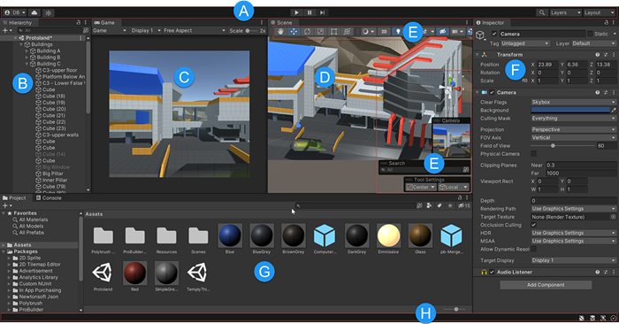 

>  A:unity工具栏  B:物体对象  C:运行视图  D:编辑视图  E:基本工具  F:检视窗口  G:项目窗口  H:状态栏

### 1.2场景

- 场景是一个**虚拟空间**，用于承载**物体对象**（GameObject）、光源、摄像机、UI 界面等元素。

------

### 1.3资源

- 常见资源类型（按功能分类）

| 类别         | 资源名称      | 常用格式                                               | 用途说明                          |
| ------------ | ------------- | ------------------------------------------------------ | --------------------------------- |
| **图像资源** | 图片 / 贴图   | `.png`, `.jpg`, `.psd`, `.tga`, `.bmp`, `.gif`（静态） | UI 图标、模型贴图、背景图、按钮等 |
| **3D 模型**  | 角色/场景模型 | `.fbx`, `.obj`, `.dae`, `.3ds`, `.blend`               | 构建角色、建筑、道具等三维对象    |
| **音频资源** | 音效 / 音乐   | `.wav`, `.mp3`, `.ogg`, `.aiff`                        | 背景音乐、角色语音、操作反馈      |
| **视频资源** | 视频剪辑      | `.mp4`, `.mov`, `.webm`, `.avi`                        | 开场动画、过场视频、引导内容      |
| **字体资源** | 字体文件      | `.ttf`, `.otf`                                         | UI 文字显示、特定风格字型         |
| **动画资源** | 动画动作      | `.anim`, `.fbx`（含动画）、`.controller`               | 角色动作、UI 动效、状态切换       |

- Unity 专有资源类型（编辑器生成或特有结构）

| 文件类型        | 后缀名                    | 用途说明                                      |
| --------------- | ------------------------- | --------------------------------------------- |
| 预制体          | `.prefab`                 | 可复用对象组合，如角色、按钮、道具等          |
| 场景文件        | `.unity`                  | 定义场景结构、对象布置、环境设置              |
| 材质            | `.mat`                    | 绑定贴图、定义表面特性                        |
| Shader 着色器   | `.shader`, `.shadergraph` | 控制渲染效果，如发光、透明、水波等            |
| 动画控制器      | `.controller`             | 管理动画状态机逻辑（如走路→跑步）             |
| 配置资源对象    | `.asset`                  | 由 ScriptableObject 创建的自定义配置文件      |
| 光照 / 导航数据 | `.asset`                  | Lighting / NavMesh / Occlusion 等系统资源数据 |
| 元信息文件      | `.meta`                   | 每个资源自动生成，标识唯一性，确保引用一致性  |
| 时间轴 / 过场   | `.playable`（内部）       | 控制剧情播放、镜头切换、对白时序等            |

- 数据配置资源（常用配置）

| 类型             | 格式               | 用途说明                                        |
| ---------------- | ------------------ | ----------------------------------------------- |
| JSON 数据        | `.json`            | 常用于软件数据、热更新配置、镜头数据            |
| CSV / 表格       | `.csv`, `.xls(x)`  | 多语言文本、软件数据、步骤参数                  |
| 文本文件         | `.txt`, `.ini`     | 简单配置                                        |
| XML 文件         | `.xml`             | 结构化数据，部分老项目使用                      |
| ScriptableObject | `.asset`           | Unity配置、镜头数据、插件配置等，支持可视化编辑 |
| PlayerPrefs      | 无文件（本地存储） | 本地轻量设定，如音量、语言选择等 （写入注册表） |

- 其他重要文件

| 类型     | 文件名 / 格式                 | 用途说明                 |
| -------- | ----------------------------- | ------------------------ |
| 脚本文件 | `.cs`（C# 语言）              | 控制程序逻辑、交互、行为 |
| 插件文件 | `.dll`, `.aar`, `.jar`, `.so` | 引入第三方库、插件       |

------

### 1.4预制体-模板

- **省时省力**：一个做好的物体（如输入框、按钮、模型预制体）可以反复使用，不用重复制作。
- **统一修改**：改一次预制体，所有使用它的地方都会一起更新。
- **让场景更整洁**：把复杂内容打包成一个“盒子”，场景更清晰好管理。
- **支持动态生成**：软件运行时也能创建，比如动态创建步骤列表。
- **便于协作**：预制体是独立文件，程序、美术、产品都能同时参与，减少冲突。

> 注：模型替换模型需要注意正确性，复核替换内容

------

### 1.5 脚本（Scripts）

- **核心作用**：控制软件逻辑、交互逻辑等，是项目运行的“代码大脑”。
- **特点**：
  - 使用 C# 编写，保存在 `.cs` 文件中；
  - 通常划分为逻辑层（软件逻辑）、表现层（动画、UI控制）和数据层（配置等）；
  - 常见结构包括：`Manager`、`Controller`、`Service`、`Model`、`Utils` 等。

------

### 1.6 UI 结构（UI）

- ##### **UI 界面资源**（使用 `Canvas` 构建）包括：
  
  - 面板预制体（如：`MainPanel.prefab`）；
  - UI 控制脚本（如：`MainController.cs`）；
  - 图像素材（按钮、图标、背景等）；
  - 动画（弹入弹出、过渡效果）；
  - 字体资源、富文本等。

- #####  UI 类型分类表

  | 类型       | 定义                           | 是否可多个共存 | 层级规则                 | 遮罩 | 典型场景                 | 备注                       | 图例                                                         |
  | ---------- | ------------------------------ | -------------- | ------------------------ | ---- | ------------------------ | -------------------------- | ------------------------------------------------------------ |
  | **Panel**  | 主界面类 UI，作为底层内容      | 否             | 固定在 UI 最底层         | 是   | 登录页、加载页、主界面   | 切换时互斥，只显示一个     | 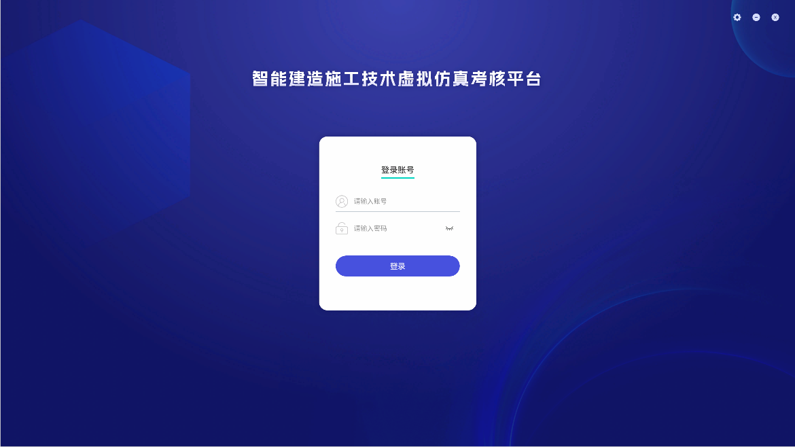 |
  | **Dialog** | 功能性对话框，支持多个叠加显示 | 是             | 按打开顺序依次叠加       | 可选 | 表单、图纸、规范内容窗口 | 可设固定层级（如设置界面） |  |
  | **Popup**  | 临时提示信息，提供反馈或警告   | 是             | 始终置于所有 UI 的最顶层 | 否   | 错误提示、警告、反馈     | 显示时间短，不阻断主流程   |  |

------

### 1.7 管理器系统（Managers）

- **统一控制游戏各系统模块的生命周期和逻辑**，如：
  - `SceneManager`：场景模型管理；
  - `AudioManager`：背景音乐与音效管理；
  - `UIManager`：UI 面板切换与层级控制；
  - `InputManager`：统一输入管理；
  - `ObjectPoolManager`：对象池复用。

------

### 1.8 插件与第三方库（Plugins / Packages）

- **常见形式**：
  - `Assets/Plugins`：传统方式引入 `.dll`、`.aar`、`.so` 等插件；
  - `Packages/manifest.json`：通过 Unity Package 管理（UPM）引入官方和第三方包；
- **用途**：
  - 图形、输入、热更框架（如 DOTween、UniTask、YooAsset）；
  - 编辑器工具（如 Odin、Cinemachine、TextMeshPro）。

------

### 1.9 脚本化资源（ScriptableObjects）

- **功能**：
  - 用于可视化配置数据，例如镜头参数；
  - 支持 Unity Inspector 中直接编辑，便于产品调整和使用；
- **优点**：
  - 可持久化；
  - 可引用；
  - 不依赖场景。

------

### 1.10 配置与数据（Data / Config）

- **类型**：
  - 外部配置：`.json`、`.ini`、`.txt`、`.xml`；
  - 内部配置：ScriptableObject；
- **用途**：
  - 模块配置（如环节数据配置、用户信息）；
  - 项目基础配置（ip地址、默认设置）；
  - 日志信息等。

------

### 1.11 特殊系统目录

| 目录 / 文件          | 用途说明                                     |                                                              |
| -------------------- | -------------------------------------------- | ------------------------------------------------------------ |
| **Resources/**       | 可运行时通过 `Resources.Load` 动态加载的资源 | 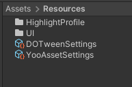 |
| **StreamingAssets/** | 打包时原样保留的文件，如视频、配置、文本     | 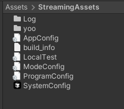 |
| **Editor/**          | 自定义编辑器脚本，构建工具、检查器扩展       | 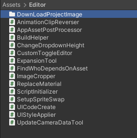 |
| **Plugins/**         | 第三方插件、Dll类                            | 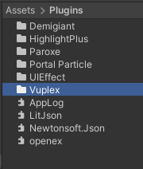 |


------

### 1.12 项目设置与元数据

| 类型               | 说明                                                     |
| ------------------ | -------------------------------------------------------- |
| `ProjectSettings/` | Unity 编辑器记录的各项项目配置，如图形、输入、构建平台等 |
| `Packages/`        | Unity 包管理器信息，`manifest.json` 控制包依赖           |
| `.meta` 文件       | 每个资源文件自动生成，用于唯一标识资源（GUID）           |


## 2.项目构建

### **2.1.选择目标平台**

- Unity 支持多平台构建，如 Windows、Mac、Linux、iOS、Android、WebGL、主机平台、团结支持鸿蒙等。根据项目需求选择目标平台。

### **2.2.构建设置(Build Settings)**

- 场景选择：决定哪些场景会被打包进最终包
- 目标平台：选择发布平台（例如 Android）
- 构建选项：是否开启压缩、开发者模式、脚本调试等

### **2.3.压缩与资源打包**

- 开启压缩能减少包体积，但会增加加载时间和打包时间
- 资源是否分包（AssetBundle/Addressables）影响更新和加载效率，合理分包***（加载存在卡顿，资源过大或者资源包包含文件过多需要分包）


> Unity资源打包原理：
>
> - 场景里用到的资源（如图片、模型、声音等）
> - 被这些资源**间接引用**到的其他资源
> - Resources 文件夹里的所有资源（不管用没用到）
> - 所有代码（C# 脚本）

---

> 热更构建：
>
> - 程序中只打一个**启动场景**，比如下载界面，体积很小。
> - Resources 文件夹**不再放资源**，避免把资源固定打进程序里。
> - 所有资源都单独打成**AB包**（类似“资源模块”），可以在软件运行时按需下载。
> - 程序代码分两层：
>   - **AOT层**：放在程序里，不能更新（基础能力）
>   - **热更层（Hotfix）**：可远程更新，支持迭代功能
>
> 最终程序包（exe）只包含启动界面 + 基础功能，**其他内容运行时再下载更新**，更灵活、体积更小。


# 二、核心概念与工作方式


## 1.GameObject 与组件系统

#### 1.1.GameObject（游戏对象）

- Unity 场景中所有实体的基础单元。
- 是一个容器，默认仅包含 `Transform` 组件。
- 不能独立表现或交互，需通过组件赋能。

#### 1.2 Component（组件）

- 附加在 GameObject 上的功能模块。
- 控制对象行为、渲染外观、响应事件等。
- 常见组件包括：

|   类别   | 组件示例                         | 功能说明               |
| :------: | :------------------------------- | ---------------------- |
| **渲染** | `MeshRenderer`、`SpriteRenderer` | 显示模型、图片         |
| **物理** | `Rigidbody`、`Collider` 系列     | 物理运动、碰撞检测     |
| **音频** | `AudioSource`、`AudioListener`   | 播放声音、接收声音     |
| **灯光** | `Light`                          | 提供光照               |
| **动画** | `Animator`、`Animation`          | 控制动作、动画状态机   |
| **脚本** | 自定义 MonoBehaviour 脚本        | 实现业务逻辑、事件响应 |

#### 1.3 组件结构关系图（示意）

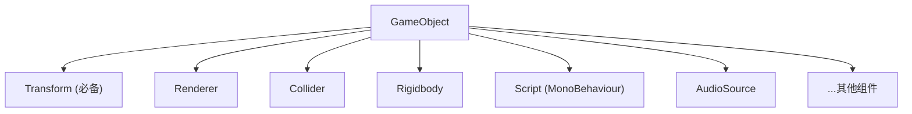


## 2.Transform：位置、旋转、缩放

###### 

- 所有 GameObject 都必须拥有 `Transform` 组件。
- 包含三个关键属性：
  - `Position`：世界或局部空间的位置
  - `Rotation`：欧拉角或四元数表示的旋转
  - `Scale`：缩放比例
- 父子层级关系通过 Transform 实现嵌套。

------


## 3. 场景管理与加载方式

#### 场景加载

| 加载方式           | 说明                                                         | 使用场景                          |
| ------------------ | ------------------------------------------------------------ | --------------------------------- |
| `LoadScene()`      | 同步加载整个场景，主线程会卡顿                               | 体积小的场景或测试时              |
| `LoadSceneAsync()` | 异步加载，不阻塞主线程，可显示加载进度                       | 正式项目推荐使用                  |
| 多场景加载         | 使用 `SceneManager.LoadScene(mode=Additive)` 实现多个场景并存 | 场景分层管理（UI场景 + 逻辑场景） |

#### 资源加载

| 方式           | 特点说明                                   | 使用建议                     |
| -------------- | ------------------------------------------ | ---------------------------- |
| Resources.Load | 同步加载 Resources 文件夹中的资源          | 适用于小型项目或少量资源加载 |
| AssetBundle    | 需要手动管理资源依赖和版本控制，灵活但复杂 | 中大型项目/热更新项目使用    |

------


## 4. UI 系统（基于 UGUI）

### 核心组件

| 组件            | 功能说明                                         |                                 |
| --------------- | ------------------------------------------------ | ------------------------------- |
| `Canvas`        | UI 渲染根容器，决定 UI 渲染模式                  |                                 |
| `RectTransform` | 控制 UI 元素的位置、缩放和锚点                   |  |
| UI 控件         | `Text`、`Image`、`Button`、`Toggle`、`Slider` 等 |                                 |


### Canvas 渲染模式

| 模式                   | 特点                                 | 应用场景                                         | 图片                            |
| ---------------------- | ------------------------------------ | ------------------------------------------------ | ------------------------------- |
| Screen Space - Overlay | 覆盖整个屏幕，无需摄像机             | 简单 UI、菜单                                    |     |
| Screen Space - Camera  | 渲染在指定摄像机前方，支持景深等效果 | 动态 UI 与世界交互                               |      |
| World Space            | UI 位于 3D 世界中，像普通物体一样    | 场景内的交互面板等（例：文字标签、检测盖章表单） |  |


### 屏幕适配

- 使用 `CanvasScaler` 控制缩放模式。

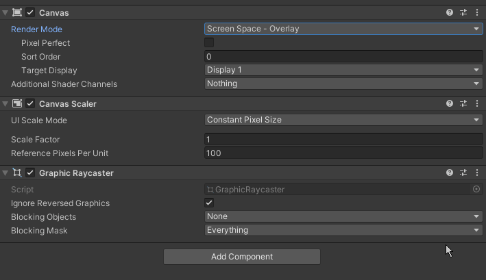

- **UI Scale Mode**确定画布中的 UI 元素的缩放方式。

| 属性                       | 功能                                                         | 图例                                                         |
| -------------------------- | ------------------------------------------------------------ | ------------------------------------------------------------ |
| **Constant Pixel Size**    | 无论屏幕大小如何，UI 元素都保持相同的 **像素大小**。         |  |
| **Scale With Screen Size** | 屏幕越大，UI 元素越大。                                      |  |
| **Constant Physical Size** | 无论屏幕大小和分辨率如何，UI 元素都保持相同的 **物理大小**，与**Constant Pixel Size**类似，只是位置和大小以物理单位指定，例如毫米、点或派卡。 |  |


- 合理设置锚点和 Pivot，实现不同分辨率适配。


> UITookit：使用Web 格式实现 UI 的构建和风格。
>
> IMGUI： `OnGUI` 函数绘制界面，示例：相机记录工具等。

------


## 5. 渲染系统基础

| 概念             | 说明                                                         |                                                              |                                                              |
| ---------------- | ------------------------------------------------------------ | ------------------------------------------------------------ | ------------------------------------------------------------ |
| 材质（Material） | 使用 Shader + 贴图控制外观                                   | 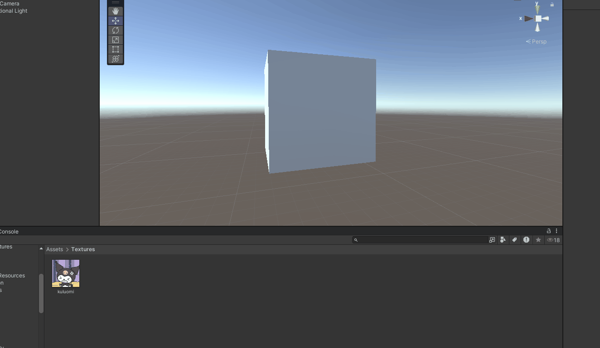 |                                                              |
| Shader           | 控制像素/顶点渲染逻辑，支持自定义视觉效果                    | 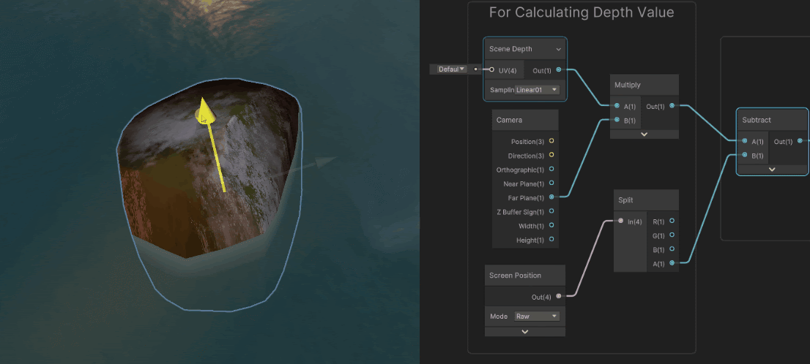 |  |
| 渲染管线         | 内置渲染管线（Built-in）、URP、HDRP                          |                                                              |                                                              |
| 光照模型         | 实时光照、烘焙光照、混合光照、GI 全局光照                    |  |                                                              |
| 屏幕后处理       | 增加真实感、风格统一，通过抗锯齿、模糊、锐化等技术改善画面细节 |  |                                                              |

------


## 6.物理系统

Unity 实现了两个独立的物理系统：

| 系统类型        | 引擎         | 用于             |
| --------------- | ------------ | ---------------- |
| **3D 物理系统** | NVIDIA PhysX | 用于 3D 游戏场景 |
| **2D 物理系统** | Box2D        | 用于 2D 游戏场景 |

### 核心概念

| 概念                                | 说明                                                 |                                                              |
| ----------------------------------- | ---------------------------------------------------- | ------------------------------------------------------------ |
| **刚体（Rigidbody / Rigidbody2D）** | 控制物体受物理规则（如重力、力、速度）影响。         | 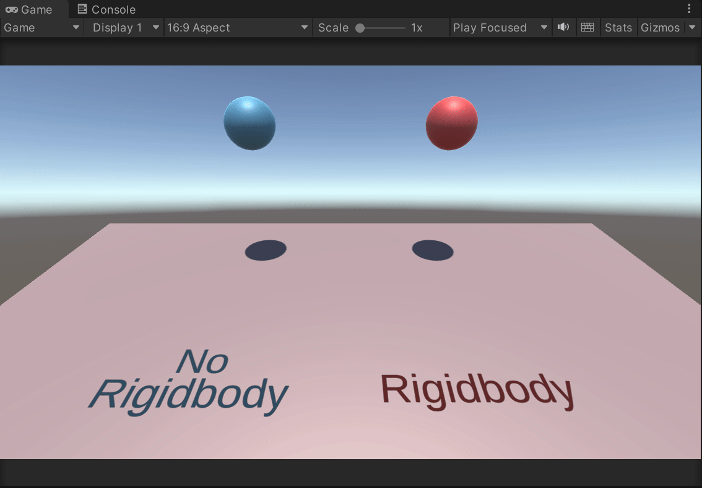 |
| **碰撞体（Collider / Collider2D）** | 定义物体形状，用于碰撞检测，不可见。                 | 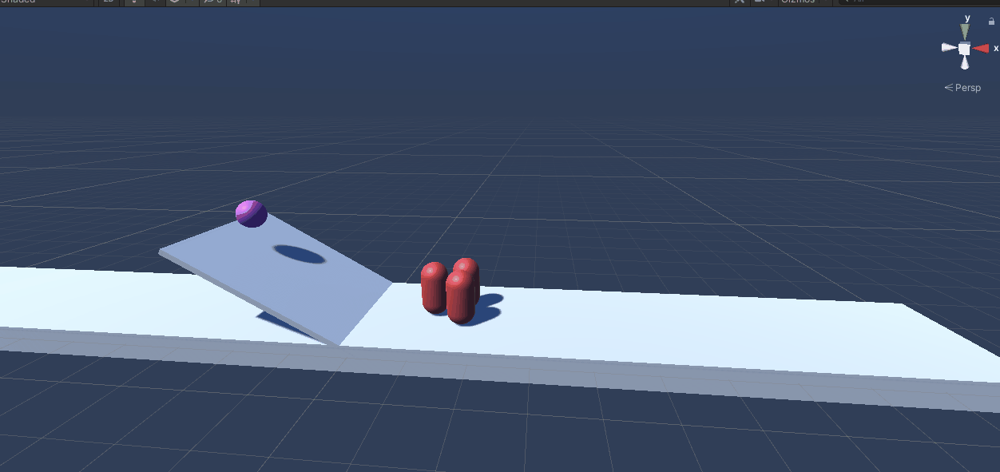 |
| **触发器（Trigger）**               | 一种特殊碰撞体，不产生物理反应，仅触发事件。         | 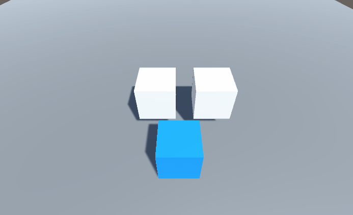 |
| **力（Force）**                     | 通过 AddForce 作用于刚体，让物体产生加速度。         | 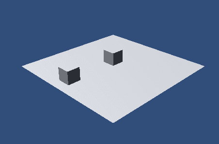 |
| **重力（Gravity）**                 | 全局重力可通过 Project Settings 设置，影响所有刚体。 |                                                              |
| **物理材质（PhysicMaterial）**      | 设置摩擦力、弹力等参数，模拟真实表面行为。           | 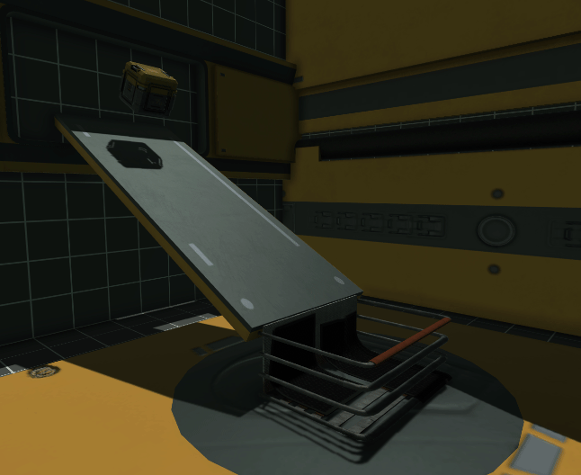 |

### 常用组件

#### 3D 物理组件

| 组件                                           | 功能                                                       |                                                              |
| ---------------------------------------------- | ---------------------------------------------------------- | ------------------------------------------------------------ |
| Rigidbody                                      | 添加质量、速度、重力等参数。                               |                                                              |
| BoxCollider / SphereCollider / CapsuleCollider | 定义几何形状的碰撞区域。                                   | 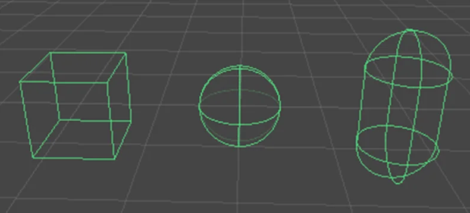 |
| MeshCollider                                   | 使用模型网格定义复杂碰撞体（可选是否使用碰撞网格的凸包）。 | 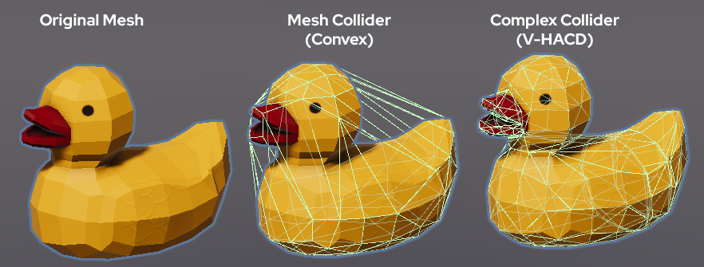 |
| CharacterController                            | 用于角色移动控制器，内建碰撞检测，非物理驱动。             |  |
| Joint（关节）                                  | 模拟弹簧、连接、旋转限制等机械结构。                       | 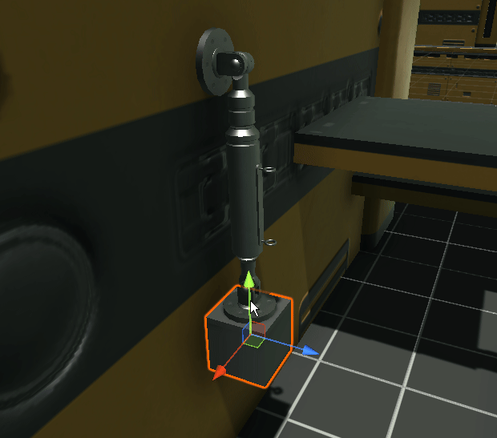 |

#### 2D 物理组件

| 组件                                                 | 功能               |
| ---------------------------------------------------- | ------------------ |
| Rigidbody2D                                          | 控制 2D 刚体行为。 |
| BoxCollider2D / CircleCollider2D / PolygonCollider2D | 定义2D碰撞体。     |
| PhysicsMaterial2D                                    | 控制摩擦与弹性。   |
| HingeJoint2D / DistanceJoint2D 等                    | 用于构建连接结构。 |

---


## 7.动画系统

Unity 动画系统是控制模型动作、UI 动效、角色行为的关键系统，包含多种方式：

| 类型                  | 系统                           | 用途                             |                                                              |
| --------------------- | ------------------------------ | -------------------------------- | ------------------------------------------------------------ |
| **传统 Animation**    | Animation + AnimationClip      | 简单动画（UI、物体移动等）       |  |
| **Mecanim 动画系统**  | Animator + Animator Controller | 角色动画、状态切换（主流方式）   |  |
| **Timeline 动画轨道** | Timeline + PlayableDirector    | 剧情动画、过场动画、相机轨道控制 | 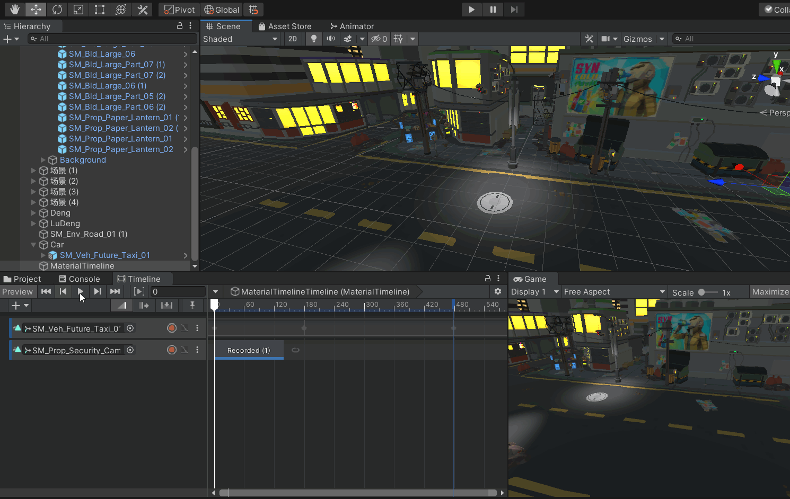 |
| **程序动画**          | 脚本中控制变换或使用 DOTween   | 动画更灵活，常用于 UI 动效       |  |

------

### Animator 系统组成（Mecanim）

| 组件                    | 说明                                                    |
| ----------------------- | ------------------------------------------------------- |
| **Animator**            | 绑定在角色对象上，驱动动画状态。                        |
| **Animator Controller** | 状态机图（State Machine），定义多个动画状态及切换条件。 |
| **Animation Clip**      | 单个动画片段，通常由外部建模工具导入（如 `.fbx`）。     |
| **Avatar**              | 骨骼映射系统，用于将动画与模型骨骼对齐。                |

### 状态机控制逻辑

| 元素                   | 说明                                              |
| ---------------------- | ------------------------------------------------- |
| **State（状态）**      | 每个动画片段是一个状态节点。                      |
| **Transition（过渡）** | 控制状态切换条件（可用参数驱动）。                |
| **Parameters（参数）** | 支持 Float、Int、Bool、Trigger 等，控制动画切换。 |

```C#
animator.SetBool("isRun", true); // 驱动动画切换
```

------

### 动画融合（Blend Tree）

- 用于将多个动画混合（如跑步与方向转身）
- 支持按参数插值融合不同方向动画，提升平滑性


## 8. 输入系统

- Unity 支持两套输入系统：
  - 旧系统：`Input.GetKeyDown()`、`Input.GetAxis()` 等
  - 新系统（Input System Package）：
    - 更强的设备支持（手柄、触屏）
    - 支持自定义 ActionMap、设备切换
- 对复杂交互推荐使用 **新输入系统**

------


## 9. 脚本与执行顺序[(MonoBehaviour)](Image/mono1.png)

#### 自定义脚本组件

- 继承自 `MonoBehaviour`，可挂载到 GameObject 上。
- 常用生命周期方法：

| 方法名          | 调用时机说明                     |
| --------------- | -------------------------------- |
| `Awake()`       | 脚本激活时立即调用，优先级高     |
| `Start()`       | 在第一帧更新前调用，适合初始化   |
| `Update()`      | 每帧调用，用于处理逻辑           |
| `FixedUpdate()` | 固定时间步长调用，适合物理逻辑   |
| `LateUpdate()`  | 所有 Update 执行后调用，适合相机 |
| `OnDestroy()`   | 对象销毁时调用，释放资源         |


#### 注意事项

- 使用 `Time.deltaTime` 控制帧率无关的行为。
- `FixedUpdate()` 不能用来检测输入（使用 Update）。

------


## 9. 其他核心系统简述

| 系统            | 简要说明                         |                             图例                             |
| --------------- | -------------------------------- | :----------------------------------------------------------: |
| Navigation      | 使用 NavMesh 实现 AI 路径寻路    |  |
| Lighting        | 设置环境光、实时光、光照贴图等   |  |
| Particle System | 粒子系统、配合shader实现视觉特效 |  |
| Profiler        | 性能分析工具，查看每帧资源耗时间 | 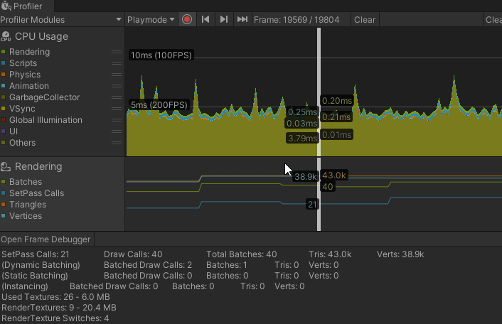 |

------


# 三、脚本逻辑和数据交互

在 Unity 中，脚本是连接用户输入、界面交互、动画逻辑和状态切换的核心。理解脚本逻辑及其与数据的交互方式，对于构建稳定可靠的功能模块至关重要。

本章将从以下三方面介绍 Unity 中脚本的组织方式：

- **事件驱动机制**：响应用户操作
- **状态控制流程**：处理复杂步骤逻辑
- **脚本结构与面向对象设计**：组织行为与数据


## 3.1.事件驱动机制

#### 目的

用户在界面中点击、滑动、输入等操作，驱动逻辑执行。事件机制负责将这些用户操作转化为函数调用。

#### Unity 事件系统组成

| 组件/概念    | 说明                               |
| ------------ | ---------------------------------- |
| EventSystem  | 统一管理和分发用户输入事件         |
| Input Module | 负责监听具体输入设备（鼠标、触摸） |
| UI 组件事件  | Button、Toggle 等组件触发事件      |
| 自定义事件   | 脚本中定义事件，代码间通信         |

#### 事件绑定方式

- **编辑器绑定**
   在 `Inspector` 面板给 UI 组件的事件（如 Button 的 OnClick）绑定函数。
- **代码绑定**
   通过脚本使用委托或事件机制动态绑定处理函数。

#### 示例

```C#
public Button myButton;

void Start() {
    myButton.onClick.AddListener(OnButtonClicked);
}

void OnButtonClicked() {
    Debug.Log("按钮被点击了！");
}
```


## 3.2.状态控制

在复杂流程或教学步骤中，常见的逻辑结构是“状态切换”，每个步骤就是一个“状态”。

#### 状态控制用途

- 控制“进入状态”“执行中”“退出状态”的切换流程。
- 保证步骤跳转时动画、UI、逻辑正确切换。
- 后续可扩展记录、回退、重播、跳步等功能。

####  状态生命周期示意

| 状态名称        | 含义                     |
| --------------- | ------------------------ |
| OnEnter()       | 进入步骤，初始化阶段     |
| SetEnterState() | 进入状态                 |
| SetState()      | 设置当前步骤正进行的动作 |
| SetExitState()  | 退出状态                 |
| OnExit()        | 离开步骤，重置步骤阶段   |

#### 状态控制代码示例（片段）

- **状态机设计**：用有限状态机设计模式，明确定义状态和切换条件。

```C#
public override async void SetState(int index) {
    switch (index) {
        case 0:
            // 动作一（例：工具领取--调用工具管理器处理）
            break;
        case 1:
            // 动作二（例：播放动画--动画控制器处理动画播放）
            break;
        case 2:
            StepController.Instance.NextStep(); // 进入下一步骤
            break;
    }
}
```

> 状态进入/退出函数建议只负责“流程”，动画与表现逻辑可委托外部管理器

------

### 状态跳转示例（精简优化）

- 支持从界面点击或代码调用方式跳转，适用于自由导航或自动流程：

```C#
// 步骤类中：控制进入与退出逻辑
public override void OnEnter() {
    // 进入步骤时执行初始化（例如播放动画、注册事件）
}

public override void OnExit() {
    // 离开步骤时清理状态（例如结束动画、移除监听）
}

// 步骤管理器中：控制状态切换
public void SetStepNode(StepBase target) {
    curStepNode.OnExit();   // 离开当前步骤
    curStepNode = target;   // 切换到新步骤
    curStepNode.OnEnter();  // 进入新步骤
}
```

> 每个步骤就像一个**独立小流程单元**：
>  它知道“自己进来时要做什么”，“退出时要收尾什么”。这种结构可以自由跳转任意步骤，不会出现状态错乱或残留问题。


## 3.3.C# 简单了解

### 3.3.1.脚本作用

- 用于控制游戏对象的行为和交互逻辑。
- 实现游戏规则、动画控制、UI交互等功能。

### 3.3.2.脚本基本结构

- Unity 脚本通常继承自 [`MonoBehaviour`](Image/mono1.png)。
- 主要包含以下生命周期函数：

| 函数名      | 触发时机                 | 作用说明               |
| ----------- | ------------------------ | ---------------------- |
| Awake       | 脚本实例化时调用         | 初始化数据，准备工作   |
| Start       | 游戏开始后第一帧调用     | 逻辑启动，准备就绪     |
| Update      | 每帧调用                 | 持续检测输入或更新状态 |
| FixedUpdate | 固定帧率调用（物理相关） | 处理物理模拟           |
| OnDestroy   | 脚本或对象销毁时调用     | 清理资源               |


## 3.4. 面向对象编程（OOP）

> 面向对象是一种**构建逻辑模块和功能组件**的思维方式，核心在于将现实中的事物转换为**“对象”**，每个对象具有自己的属性与行为。

### 3.4.1 基础-抽象：

> **抽象**指的是：从复杂的现实中提取“共同特征”，形成统一的逻辑模板，忽略无关细节。

#### 目的：

- 将复杂逻辑“模块化”
- 减少重复开发
- 保证结构一致，易于维护和扩展

------

### 例：表单答题逻辑的抽象设计

一个项目中有多种题型，如：

- **填空题**：输入答案
- **单选、多选题**：点击选项
- **下拉选择题**：从选项中挑选

这些虽然形式不同，但其核心交互行为可以抽象为三个**基础类型**：

| 题型样式   | 抽象归类                |
| ---------- | ----------------------- |
| 填空、填表 | 输入类 `InputAnswer`    |
| 单选、多选 | 选择类 `ToggleAnswer`   |
| 下拉       | 下拉类 `DropdownAnswer` |

这些题型可统一为两个核心类型：`输入类` 和 `选择类`，并共用统一的基类行为。

------

### 抽象结构图

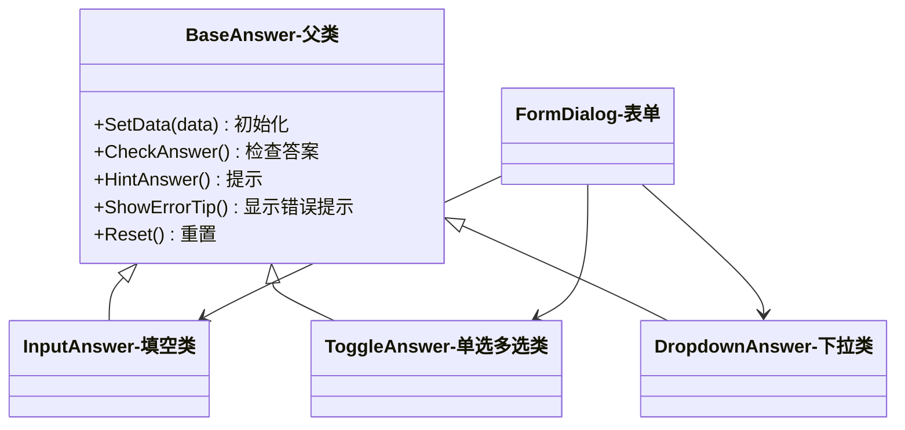

------

### 类功能详解

#### `BaseAnswer`（答题基类）

封装所有题型的公共逻辑，其他答题类型都继承自此类。

```c#
class BaseAnswer : MonoBehaviour {
    public virtual void SetData(QuestionData data);        // 绑定题目数据
    public virtual bool CheckAnswer();                     // 判断正误
    public virtual void HintAnswer();                      // 显示正确答案提示 (按T提示)
    public virtual void ShowErrorTip();                    // 显示错误提示
    public virtual void Reset();                           // 重置答题状态
    
    private void Update()
    {
        if (!DataManager.Instance.depPromptSwitch)return;//禁用提示
        if (Input.GetKeyDown(KeyCode.T))
        {
            HintAnswer(); // 提示答案
        }
    }
}
```

------

####  `InputAnswer`（输入题类型）

如填空题，核心行为是输入文本并比对正确答案。

```C#
class InputAnswer : BaseAnswer {
    override void SetData(QuestionData data) {
        //Todo 设置题目文本、输入框宽度自适应
    }

    override bool CheckAnswer() {
        //Todo 检查用户输入的答案是否匹配答案
    }

    override void HintAnswer() {
        //Todo 填入正确答案 (按T提示)
    }

    override void ShowErrorTip() { ... }
    override void Reset() { ... }
}
```

------

####  `ToggleAnswer`（选择题类型）

如单选、多选、下拉题，核心是创建选项并对比正确项。

```C#
class ToggleAnswer : BaseAnswer {
    override void SetData(QuestionData data) {
        //Todo 根据题目数据创建选项
    }

    override bool CheckAnswer() {
        //Todo 判断当前的选择是否正确
    }

    override void HintAnswer() {
        //TOdo 勾选正确项，取消错误项 (按T提示)
    }

    override void ShowErrorTip() { ... }
    override void Reset() { ... }
}
```

------

####  `FormDialog`（题目容器）

用于组织和管理所有题型组件，并统一调用判断、提示等操作。

```C#
class FormDialog 
{
    List<BaseAnswer> baseAnswers;//例如： baseAnswers 存储了1个填空，2个多选，1个下拉

    public override void OnClick(GameObject go)
    {
        switch (go.name)
        {
            case "Button_Confirm":
                foreach (var t in baseAnswers)
                {
                    t.CheckAnswer() //在表单中无需关心题目是什么类型，统一调用 BaseAnswer 父类的 CheckAnswer。
                }
                break;
        }
    }
}
```

------

####  案例抽象设计带来的好处

| 优势           | 说明                                                         |
| -------------- | ------------------------------------------------------------ |
| 结构统一       | 所有题型都基于同一个父类结构                                 |
| 易于新增题型   | 添加新题型只需继承 `BaseAnswer` 并实现自己的逻辑             |
| 易于维护       | 修改或优化某一共性功能，只需改动 `BaseAnswer`，例：需要控制是否启用提示功能 |
| 灵活提示与联动 | 通过接口统一处理提示逻辑、交互状态                           |
| 快速搭建表单   | 新增表单不需要再处理  **`题目逻辑`**  以及  **`题目样式`**，只需要处理表单样式的搭建和表单的逻辑 |


##  3.4 面向对象三大特性

面向对象编程有三个核心特性：

- **继承**：复用已有能力
- **封装**：只暴露“该看的”部分
- **多态**：相同的操作，不同的行为表现


### 3.4.1. 继承（Inheritance）——“孩子像父母”

- **通俗解释：**
   子类自动拥有父类的功能，就像孩子天然继承父母的基因。

- **举例类比：**

  - “动物”都会吃和睡
  - “猫” 和 “狗” 都是动物，但也各自有特长：猫会爬树、狗会看家

- **现实例子：**
   做多个答题组件（如填空题、选择题）时，它们都继承了 `BaseAnswer` 的通用功能（如判断答案、提示、重置等），只需补充自己的特色功能。

- **示意图：**

  ```mermaid
  classDiagram
      class BaseAnswer {
          +CheckAnswer()检查答案
          +HintAnswer()提示
          +Reset()重置
      }
      class InputAnswer {
          +SetCaretWidth()设置光标宽度
      }
      class ToggleAnswer {
          +SetTransition()设置缓动样式
      }
  
      BaseAnswer <|-- InputAnswer
      BaseAnswer <|-- ToggleAnswer
  ```

------

### 3.4.2. 封装（Encapsulation）——“只看得见按钮，看不见电路”

- **通俗解释：**
   把复杂内容包在“盒子”里，只开放必要的操作，内部怎么实现用户不需要关心。
- **现实例子：**
   在程序中，外部系统（表单）仅调用 `CheckAnswer()` 就能实现  **`判断对错、错误提示、记录留痕`**，表单不必知道是如何进行的答案比对、怎么处理错误UI显示、以及如何发送留痕等。
- **产品意义：**
  - 不暴露复杂内部逻辑
  - 更稳定，别人不会“误操作”
  - 易于维护，内部可自由调整

------

### 3.4.3. 多态（Polymorphism）——“同样的按钮，不同的反应”

- **通俗解释：**
   同一个操作，在不同对象上有不同表现。

- **现实例子：**

  - “点击播放”：音乐播放器播放音乐，视频播放器播放视频

- **在项目中：**

  - 所有答题组件都实现了 `HintAnswer()` 方法
  - 调用时，不用关心具体题型，只管调用 `HintAnswer()`，不同类型自己决定该如何提示

- **结构类图复用：**

  ```mermaid
  classDiagram
    class BaseAnswer {
        +HintAnswer()
    }
  
    class InputAnswer {
        +HintAnswer() // 自动填入文本
    }
  
    class ToggleAnswer {
        +HintAnswer() // 自动勾选正确选项
    }
  
    BaseAnswer <|.. InputAnswer
    BaseAnswer <|.. ToggleAnswer
  ```

------

### 面向对象总结

| 特性     | 理解                                   | 对产品的帮助与价值                                   |
| -------- | -------------------------------------- | ---------------------------------------------------- |
| **抽象** | 把复杂功能拆成通用模块和核心要素       | 设计功能时更清晰，减少冗余需求，便于统一规划和管理   |
| **继承** | 新功能基于已有功能扩展，不用从零开始   | 新产品需求或新题型能快速上线，提升开发效率和响应速度 |
| **封装** | 复杂功能对外表现简单接口，隐藏内部实现 | 产品使用和维护更简单，降低误用风险，提升系统稳定性   |
| **多态** | 同一操作对不同功能产生不同效果         | 产品交互统一，用户体验一致，同时支持多样化功能扩展   |

> 面向对象编程是 Unity 开发的基础，不仅体现在（如表单类）中，也广泛应用于步骤控制、API 接口封装等各类功能的实现。


# 四、调试与测试常识


## 1.控制台（Console）

#### 日志等级分类

| 类型            | 颜色      | 含义                                       |
| --------------- | --------- | ------------------------------------------ |
| Error（错误）   | 红色      | 严重问题，导致程序异常或崩溃，必须优先解决 |
| Warning（警告） | 黄色      | 潜在问题或非致命错误，可能影响功能或性能   |
| Log（普通日志） | 白色/灰色 | 程序运行信息，调试时用于输出变量或流程状态 |

## 2.性能瓶颈常识

#### 常见性能瓶颈类型

| 类型         | 表现                         | 说明                               |
| ------------ | ---------------------------- | ---------------------------------- |
| GPU 过载     | 渲染延迟，画面卡顿           | 过多高精度模型、复杂特效、过大贴图 |
| 内存不足     | 加载缓慢，频繁卡顿，崩溃     | 资源未及时释放，内存泄漏           |
| 磁盘 IO 瓶颈 | 加载时间长，场景切换卡顿     | 资源加载频繁或单次加载资源体积大   |
| CPU 过载     | 帧率不稳定，游戏逻辑响应变慢 | 脚本计算量大，Update 函数耗时过多  |

#### 具体影响因素

- **对象数量多**：大量 GameObject 或组件实时更新影响 CPU。
- **高多边形模型**：增加 GPU 负担。
- **大贴图和粒子特效**：占用显存和渲染资源。
- **频繁动态加载资源**：磁盘读取压力大。
- **物理计算复杂**：大量碰撞体计算消耗 CPU。

#### 4. 性能优化方向

- 降低 Update 中无效计算频率。
- 减少场景中活跃物体数量。
- 合理使用 LOD（细节层次）和静态合批。
- 优化贴图大小和格式。
- 异步加载资源，分散加载压力。
- 合理设计物理碰撞体。

#### 5. 产品关注点

- 识别卡顿和掉帧时间点，定位对应场景或功能点。
- 配合开发确认性能指标与优化方案。
- 规划合理资源预算，避免超出设备承载。


# 五、热更新与资源管理

## 1.热更新概述

热更新是指在客户端发布后，不需要重新发布客户端应用即可更新软件内容或逻辑的技术。Unity 中常见的热更新方式主要有以下几种：

- **资源热更新**：通过网络下载和加载更新的资源，如图片、音频、场景、预制体等。
- **代码热更新**：通过 **IL2CPP** 或 **Mono** 热更新框架，动态修改和更新 C# 代码逻辑。

## 2.资源热更新

### 2.1.AssetBundle

**AssetBundle** 是 Unity 官方提供的资源打包和热更新方案，允许将资源打包成独立的文件并在运行时按需加载。

#### 关键点：

- **打包**：通过 Unity 编辑器将资源打包成 AssetBundle 文件。
- **加载**：在运行时使用 `AssetBundle.LoadFromFile()` 或 `AssetBundle.LoadFromMemory()` 加载。
- **卸载**：使用 `AssetBundle.Unload(true)` 来卸载不再使用的资源。

#### 优化建议：

| 优化方向   | 说明                                                        |
| ---------- | ----------------------------------------------------------- |
| 按需加载   | 根据场景或功能模块按需加载和卸载资源。                      |
| 资源压缩   | 使用压缩格式减少下载包体积（如 LZ4）。                      |
| 分包与更新 | 分包管理，避免大规模更新时重新下载所有资源。                |
| 异步加载   | 使用异步加载 `AssetBundle.LoadFromFileAsync()` 以避免卡顿。 |

### 2.2.代码热更新

Unity 支持使用 **Mono** 和 **IL2CPP** 实现代码的热更新，通常有两种方式：

#### Mono 代码热更新

Mono 是 Unity 中早期支持的代码执行环境，通过动态加载的方式来支持代码热更新。

- 通过 **Mono.Cecil** 库动态修改和替换程序集。
- 适用于较为简单的项目或不使用 IL2CPP 的项目。

#### 常见热更新框架：

- **[XLua](https://github.com/Tencent/xLua)**：腾讯的开源项目，方案成熟，用于 Lua 脚本的热更新，动态运行和修改。
- **[ILRuntime](https://github.com/Ourpalm/ILRuntime)**：一个 .NET 运行时，可以动态加载并执行 C# 脚本，支持热更新。
- **[HyBridCLR](https://hybridclr.doc.code-philosophy.com/)**：C++实现，与il2cpp高度集成，原生支持动态加载assembly，从底层上支持了热更新。

#### IL2CPP 代码热更新

IL2CPP 是 Unity 推出的更为安全和高效的代码执行环境，它将 C# 代码转换成 C++ 代码并编译生成原生应用。IL2CPP 本身不直接支持代码热更新，但可以通过一些技术手段实现：

- **热修复方案**：通过动态加载原生插件（如 `.dll` 文件）来实现热更新。
- **反射与动态调用**：通过反射机制动态调用更新后的代码。


> **代码裁剪**
>
> 在 Unity 的 IL2CPP 构建环境中，当构建可执行文件（如 `.exe`）时，Unity 会对使用的程序集（包括 Unity 的内置程序集和项目代码）进行裁剪（Strip），以减少最终包体大小。
>  例如：某个 Unity 类包含 5 个方法，但项目中只调用了其中的 2 个方法，那么在构建过程中，Unity 可能会将其余 3 个未被调用的方法从最终的构建中剔除。


> **无法热更的原因：**
>
> 1. **方法被裁剪导致运行时缺失：**
>     由于构建时未用到的方法会被裁剪，若后续热更的逻辑中使用了这些方法，在运行时就会出现“方法不存在”或“MissingMethodException”等错误。这种情况只能通过重新构建主工程（重新生成 exe）来解决。提前规避：Unity提供了xml配置文件让需要使用的类和方法不被裁剪，可以部分规避，无法提前预知后续所有需要使用的类和方法，会增大包体。
> 2. **插件依赖原生类型或缺失元数据：**
>     某些插件（如基于 C++ 实现的 DLL）不是通过 C# 编写的，它们可能使用了原生类型（Native Types）或结构体。如果这些类型在原始构建的 exe 中未包含（因为未被引用或未生成必要的元数据），则后续通过热更添加这些插件时，将因为缺少必要的元数据而导致运行失败。因此，此类插件必须构建到主工程（exe）之中（不可通过热更添加）。只能热更 ***纯 C# 编写、且未依赖裁剪内容的代码逻辑***。

